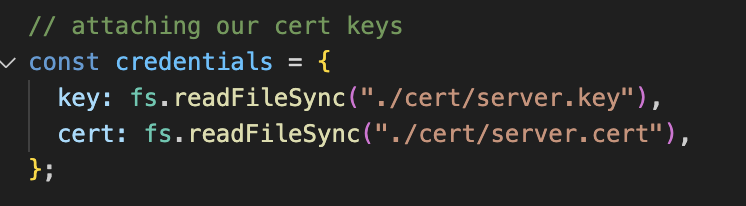

# Daily Quest Tracker
RPG style app where users complete daily tasks (quest) and earn XP to level up. It would allow users to form positive habits by gamifying their routines.

## `Part A: Why this App?`
* This app merges two of my core interests: gaming and personal productivity. By gamifying everyday tasks as quests, it turns routine responsibilities into engaging challenges, encouraging consistent habit formation in a fun, rewarding way.

## `Part B: Configuring SSL Certificates`
*Certificate Generation Using OpenSSL*
* I used OpenSSL, a widely adopted open-source toolkit for SSL/TLS, to create a self-signed certificate suitable for development and testing environments.

### Steps Taken
1. Create a new folder for the project [Websecurity_Phase1].
2. Open terminal in VSCODE or your choice of editor. 
3. Create a Certificate Directory at project root.
    `mkdir cert`
4. Generate Private Key and Self-Signed Certificate
    `openssl req -nodes -new -x509 -keyout cert/server.key -out cert/server.cert`
    * This command generates a private key (server.key) and a self-signed certificate (server.cert) in one step.
    * The -nodes flag ensures the private key is not encrypted, allowing the server to start without prompting for a password.
    * During the prompt, fields like Country, State, Organization, and Common Name (typically localhost for development) were filled.
> *Note:* SSL Integration in Code In APP.js, the certificate files were loaded using Node.js's fs module and passed to the https.createServer() method:


### Rationale and Real-World Considerations

Why OpenSSL?
* I chose OpenSSL to create a self-signed SSL certificate over Let’s Encrypt / Certbot since I’m running the app locally during development.
* I am also quite familiar as to how OpenSSL works as we’ve used it in our previous labs. 
* It is also faster, simpler, and does not require for my app to have a domain name.

Why Self-Signed? 
* For development and local testing, self-signed certificates avoid the need and cost of purchasing a trusted CA certificate.
* In a production environment however, a certificate from a recognized Certificate Authority (CA) would be used instead.

## `Part C: Configuring Essential HTTP Headers`

*Configuring Essential HTTP Headers*
To further secure the server, we configured several critical HTTP headers using the helmet middleware package:

1. Helmet Middleware Activation
`const helmet = require("helmet");
app.use(helmet());`
> Helmet helps set many secure headers by default, such as X-DNS-Prefetch-Control, X-Frame-Options, and X-Content-Type-Options.
> 

1a. Content Security Policy (CSP)

- Protects against Cross-Site Scripting (XSS)
- Tells the browser what sources it's allowed to load content (scripting, styles, etc) which is set to "self".

1b. X-Frame Options
- Protects against clickjacking.
- Attackers cannot trick users to click on something invisible.
```
app.use(helmet.frameguard({action: "deny"}));
```

1c. HTTP Strict Transport Security (HSTS)
- Enforces use of HTTPS by instructing browsers to reject HTTP connections.
- preload: true indicates intent to include the site in browser preload lists.
- `maxAge: 31536000`
- 31536000 seconds = 1 year
- Setting maxAge to one year is recommended by most security standards: **OWASP best practices & Google’s HSTS preload list requirements**
- This protects against downgrade attacks and ensures that even if a user types http://mywebsite.com, the browser will force it to use https://mywebsite.com.

## `Part D: Design Routes and Implement Cache Control`
1. GET /quests – Returns a list of daily quests
```
Cache-Control: public, max-age=300, stale-while-revalidate=30
```
* Purpose: Improves performance by caching quest data while allowing quick updates.
* Security: Contains non-sensitive, read-only data.
> - Public : Means the response can be stored by any cache - safe since the data is non-sensitive/.
> - Tells caches they can serve this response for up to 300 seconds (5 minutes) before considering it stale.
> - Once the response becomes stale, the cache can still serve the old content for another 30 seconds while it fetches a fresh version in the background.

2. GET /quests/:id – Returns a specific quest
```
Cache-Control: public, max-age=300
```
* Purpose: Reduces load when fetching repeat quest data.
    * If the same client (or another client using the same CDN or proxy) requests /quests again within those 5 minutes, the cached response is served instantly.
* Security: Each quest is non-sensitive, accessible to all users.

3. POST /quests – Adds a new quest
```
Cache-Control: no-store
```
* Purpose: Prevents storing of user-submitted data in caches.
    * Tells the browser, "Do not save a copy of this response anywhere.”
    * The request contains user input. Even if the quest data is not sensitive, it is user-generated and unique. 
    * POST requests are not meant to be cached by design.
* Security: Requires authentication in a real app; data must not be cached.


4. GET /profile – Returns user profile info
```
Cache-Control: no-store
```
* Purpose: Contains user-specific sensitive data like XP and badges.
* Security: Should not be cached to ensure privacy.

5. GET /guilds – Returns guild (team) info
```
Cache-Control: public, max-age=600
```

* Purpose: Guild info is static and can be cached longer to improve performance.
* Security: Public and non-sensitive.


---

# Reflection Checkpoint

The caching strategy I've implemented balances performance with data privacy and security:
- Public, non-sensitive data (quests and guilds) are cached to reduce server load and improve response time.
- Sensitive or dynamic content (profile and post requests) explicitly avoids caching.
- I used stale-while-revalidate where freshness and performance are both important (like quest lists).

Trade-offs:
- Longer caching improves performance but risks showing outdated data.
- Avoiding caching on sensitive routes ensures security but increases server load.
- Using stale-while-revalidate mitigates this by returning a slightly stale response while refreshing it in the background.


### Lessons Learned

Through this project, I learned a lot about how HTTPS and SSL work in real-world applications. At first, generating SSL certificates using OpenSSL was confusing, but doing it step-by-step helped me understand how encryption works between the browser and server.

Setting up a secure Express server with https.createServer() was something I hadn’t done before, and figuring out how to pass the certificate through in-class learning and applying it on my own was a great hands-on learning experience.

I also had some minor issues with Helmet's content security policy as I've blocked some of my images and styling until I've updated the rules.

Finally, writing cache strategies for each route showed me how caching can improve performance but also affect data freshness and security. I had a hard time understanding the proper use cases for different cache settings at first, but with reading and practice, I learned how to choose the right strategy based on whether the data is public, private, or user-generated.

---

# Dependencies & Set-up

### Prerequisites
1. Make sure Node.js is installed.
```
node -v
```
> If not installed, download it from https://nodejs.org/.

2. Confirm OpenSSL is installed and running
```
openssl version
```
> If missing, install it from https://www.openssl.org/.

### Initializing the Project

1. Clone or download the project repository from GitHub
2. Install required Node.js packages
```
npm install express helmet
```
3. The project already includes the cert/ directory with the self-signed certificate (server.cert) and private key (server.key) generated for development.
```
mkdir cert
openssl req -nodes -new -x509 -keyout cert/server.key -out cert/server.cert
```
> If you want to regenerate certificates, use this code.

4. Start the HTTPS server by running
```
node app.js
```
5. Access the app at https://localhost:3000.
> **Developer Note:** Because the certificate is self-signed and not from a trusted Certificate Authority (CA), browsers will show a security warning when first accessing the app via HTTPS. This is expected behavior during development and testing but would be resolved by using a valid CA-issued certificate in production.

Project Structure
```
Barrera_Phase1/
├── App.js
├── package.json
└── cert/
    ├── server.key
    └── server.cert
└── routes/
    ├── guilds.js
    ├── profile.js
    └── quests.js
└── public/
    ├── images/
        ├── aya.png
        └── bg.png
    ├── index.html
    ├── main.js
    └── style.css
```

---

## Footnote: Terms Defined

| Term | Meaning | 
| -------- | -------- | 
|SSL (Secure Sockets Layer):     | Standard for encrypting data between a client and a server.     | 
| OpenSSL: | A command-line toolkit for generating and managing SSL/TLS certificates.| 
| CDN (Content Delivery Network): | A geographically distributed network of servers that cache and deliver content closer to users for faster access. | 
|Helmet: | A Node.js middleware that helps secure Express apps by setting various HTTP headers. | 
| Cache-Control: | An HTTP header used to specify caching policies for responses. | 
| HSTS (HTTP Strict Transport Security):| A policy that forces browsers to use HTTPS connections. | 
